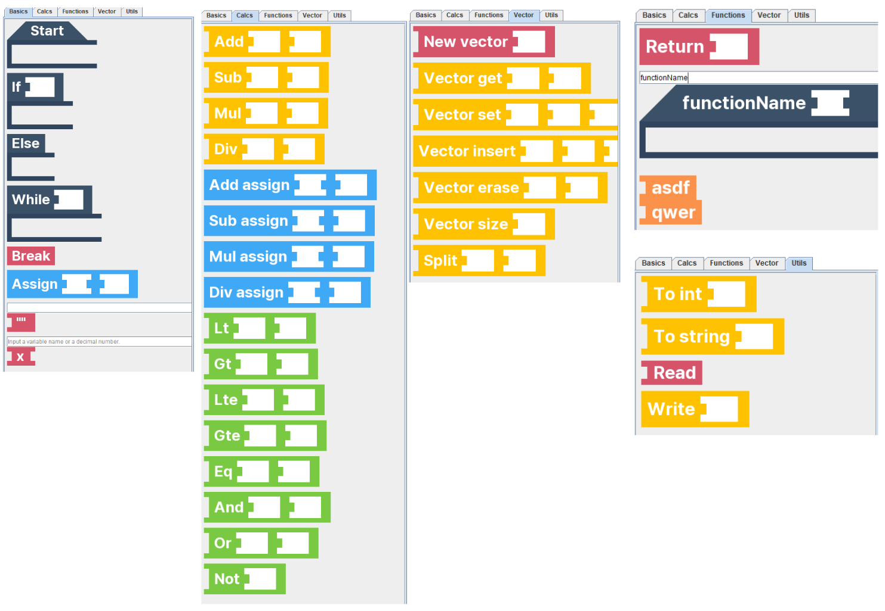
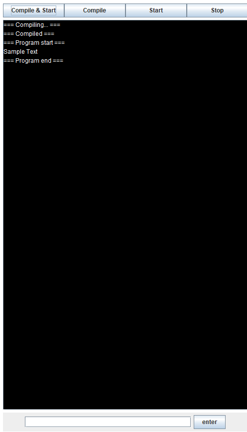
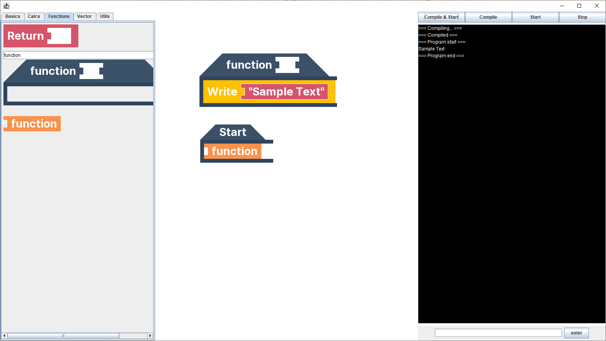
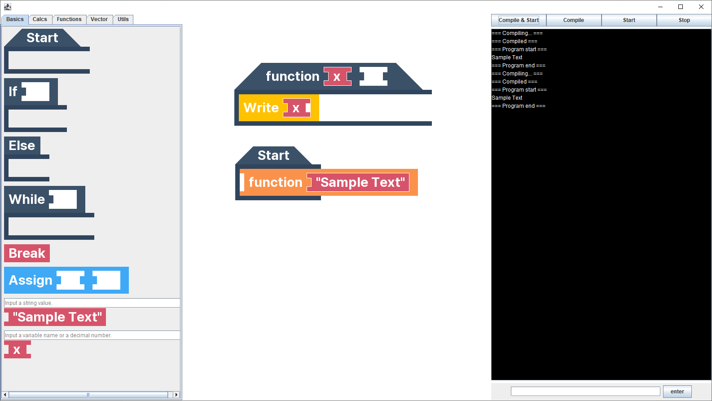
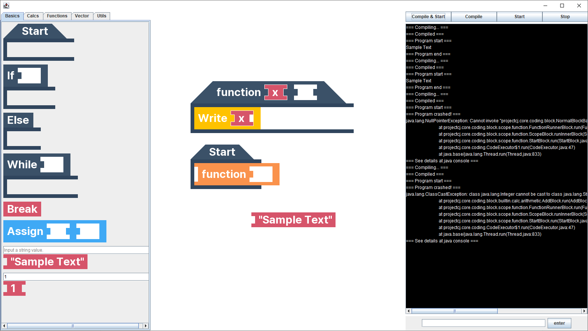
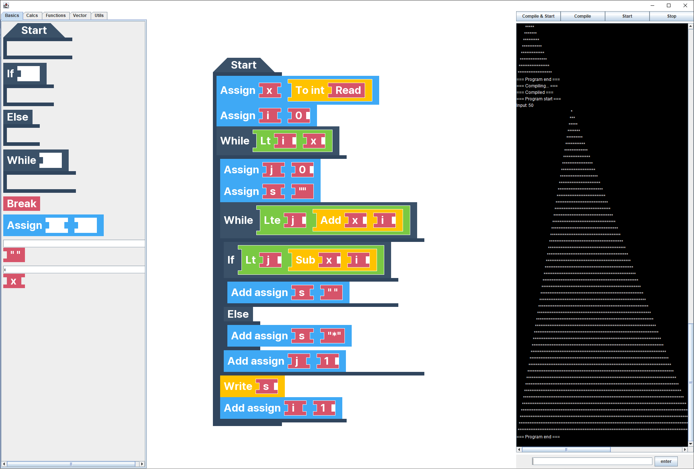
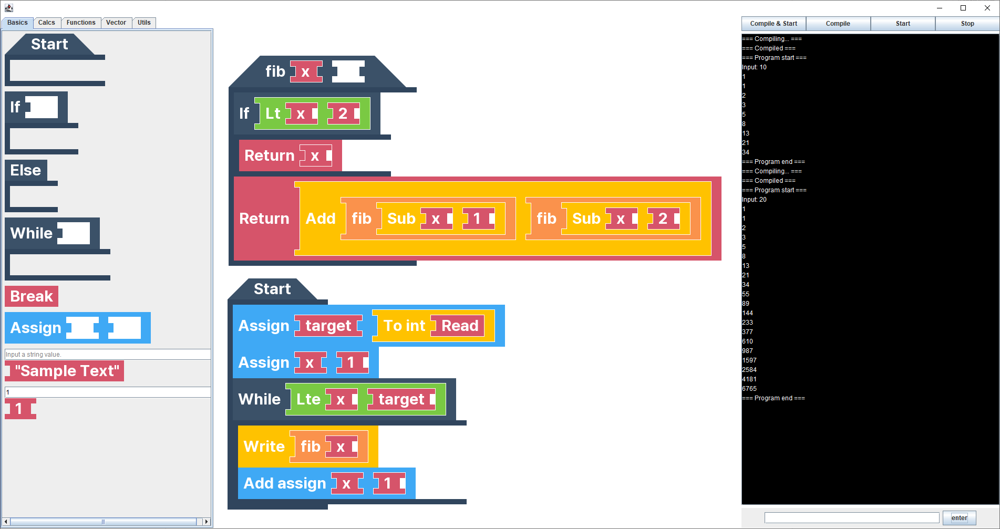
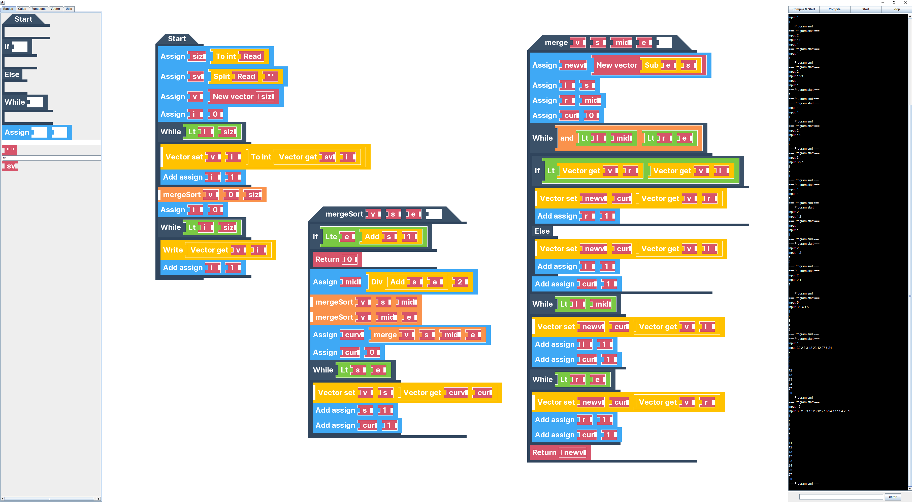

# 자바기반응용프로그래밍 기말

자바기반응용프로그래밍 기말 프로젝트로 블록코딩을 구현했다. Git 레포지토리를 확인하면 언제 얼마나 구현했는지 알 수 있다. revert 등의 명령어로 롤백해서 개발이 완료되기 전의 버전을 실행해볼 수 있다. 자바 버전은 17을 사용했다. 11에서는 오류가 발생하는 것 같다. 다른 운영체제에서는 글씨가 잘릴 수 있다.

## UI 설명

이미지가 최종 결과물과 살짝 다를 수 있다.

좌측의 JBlockSelection의 탭을 누르면 위와 같은 블록 리스트가 나오게 된다. 여기서 마우스 드래그로 블록을 만들 수 있다.

Basics의 아래 부분에는 문자열과 변수, 숫자를 만들 수 있는 입력칸이 존재한다. 둘 중 위에 있는 것은 문자열을 만든다. 아래 있는 것은 숫자를 입력하면 숫자로, 숫자가 아니면 변수 이름으로 인식한다.

Function에서는 커스텀 함수를 만들 수 있는데, 텍스트 입력칸에 함수의 이름을 입력해 커스텀 함수를 만들 수 있다.

우측의 콘솔에서는 사용자가 입력할 수 있는 입력창과 콘솔의 출력창이 있다.

상단의 버튼들로 컴파일/실행을 할 수 있으며, 프로그램이 무한루프에 빠지거나 하는 경우 Stop 버튼을 눌러 프로그램을 즉시 종료시킬 수 있다.

빈 공간을 드래그해서 보드를 움직일 수 있고, 배치된 블록을 드래그해서 블록을 움직일 수 있다.

함수를 만들면 다음과 같이 아래에 함수 실행 블록이 새로 생긴다. 이 블록으로 함수를 실행할 수 있다.

함수에 변수를 추가하는 방식으로 파라미터를 추가해 줄 수 있다. 이 때, 함수 실행 블록의 모양도 바뀐다. 위 이미지와 같이 사용할 수 있다.

함수 파라미터를 추가하면 뒤에 빈 파라미터 공간이 추가로 생긴다. 이곳에 파라미터를 추가로 넣어줄 수 있다.

예외가 발생하면 다음과 같이 오류 메시지가 출력된다.

### 예시

개발 단계에서 구현한 것들도 있어서, UI가 지금과 조금 다를 수 있다.

위와 같이 별 찍기 프로그램을 작성할 수 있다.

재귀를 활용한 피보나치도 다음과 같이 만들 수 있다.

머지소트도 다음과 같이 구현할 수 있다.

## 블록들에 대한 간단한 설명

### Basics

#### Start

시작 블록이다. 프로그램을 시작하면 가장 먼저 안에 있는 블록들을 실행한다.

#### If

파라미터 부분에 들어있는 값이 참이라면, 안에 있는 블록들을 실행한다.
빈 문자열, null, 0, false를 제외하면 참으로 인식한다.

#### Else

반드시 If문의 아래에 연결되어야 하며, If문의 파라미터에 있는 값이 거짓인 경우 실행된다.

#### While

파라미터 부분에 들어있는 값이 참인 동안 안에 있는 블록들을 반복해서 실행한다.

#### Break

While문을 한 겹 탈출한다.

#### Assign

왼쪽에 변수, 오른쪽에 변수에 넣을 값을 넣으면 변수에 해당 값을 넣어준다.

#### Literal

텍스트로 입력한 값을 가지는 문자열을 만든다.

#### Variable

텍스트로 입력한 값을 이름으로 가지는 변수를 만든다. 단, 입력한 값이 Integer나 Double로 변환될 수 있다면 해당 값을 갖는 상수가 된다.

### Calcs

#### Add, Sub, Mul, Div

파라미터로 입력받은 두 값을 더하고, 빼고, 곱하고, 나눈다.

#### ~ assign

왼쪽의 변수에 오른쪽 값을 더하고, 빼고, 곱하고, 나눈 것을 변수에 할당한다.

#### Lt, Gt, Lte, Gte, Eq

왼쪽 값이 오른쪽 값보다 작다면, 크다면, 작거나 같다면, 작거나 크다면, 일치한다면 true를 리턴한다.

#### And, Or, Not

&&, ||, ! 논리 연산을 수행한다.

### Functions

#### Return

함수를 즉시 종료하고, 함수 실행 블록의 반환값을 지정한다.

#### Function

함수의 본체이다. 함수의 파라미터에 변수를 넣을 수 있으며, 그 변수는 파라미터로 작동한다. 함수 안에서 선언한 값들은 함수의 지역 변수가 된다.

#### Function runner

함수를 실행하는 블록이다. 파라미터를 넣어 함수에 전달할 수 있다.

### Vector

#### New vector

새로운 벡터를 만든다. 크기를 입력하면 null로 가득 찬 해당 크기의 벡터를 리턴한다.

#### Vector get

왼쪽에 벡터, 오른쪽에 인덱스를 받는다. 벡터에서 해당 인덱스에 있는 값을 리턴한다.

#### Vector set

왼쪽에 벡터, 중앙에 인덱스, 오른쪽에 값을 받는다. 벡터에서 해당 인덱스에 입력한 값을 넣는다.

#### Vector insert

왼쪽에 벡터, 중앙에 인덱스, 오른쪽에 값을 받는다. 입력받은 값이 벡터에서 해당 인덱스를 가지도록 삽입한다.

#### Vector erase

왼쪽에 벡터, 오른쪽에 인덱스를 받는다. 벡터에서 해당 인덱스에 위치한 값을 삭제한다.

#### Vector size

벡터를 입력받고, 벡터의 크기를 반환한다.

#### Split

왼쪽에 입력받은 문자열을 오른쪽에 입력받은 구분자로 나누어 벡터로 만들어 리턴한다.

### Utils

#### To int

입력받은 개체를 정수로 변환한다.

#### To double

입력받은 개체를 실수로 변환한다.

#### To string

입력받은 개체를 String으로 변환한다.

#### Read

콘솔에 입력받은 값을 리턴한다.

#### Write

콘솔에 파라미터로 입력받은 값을 출력한다.

## 개선할 점

블록을 움직일 때 다른 블록이 걸려서 함께 움직이는 게 조금 불편하다. 개선할 필요가 있어 보인다.

블록 복사/삭제 기능이 필요하다.

코드 저장 기능이 필요하다.
